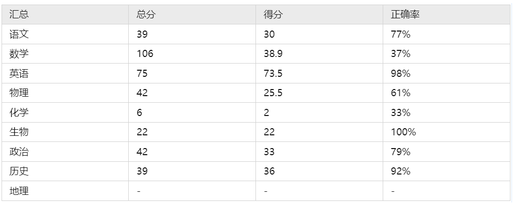

# Gaokao benchmark
## Overview
GPT-4 is a recently popular large-scale language model that has demonstrated human-level performance on multiple tasks. In the latest OpenAI technical report, GPT-4 showcased remarkable performance on exam-style tests, such as achieving a score of 169 out of 170 on the GRE Verbal Reasoning test. However, when it comes to exams, none is more significant than the college entrance examination.

Now, the question arises: what would happen if GPT-4 were to take the Beijing 2022 College Entrance Examination (Gaokao)? This article aims to help answer that question. We have compiled the examination questions for Chinese language, mathematics, English, physics, chemistry, biology, history, and geography from the Beijing 2022 Gaokao exam. We have made an effort to include both subjective and objective questions. Unlike previous assessments that focused solely on multiple-choice questions, we have intentionally incorporated non-multiple-choice questions in this evaluation. Additionally, for complex calculation questions, such as those in physics, we will analyze GPT-4's step-by-step problem-solving process rather than just looking at the final answer. Moreover, if GPT-4 provides an incorrect response, we will inquire about the reasoning behind its answer.

The reason for taking this approach is to thoroughly examine the capabilities of GPT-4 from the perspective of tackling college entrance examinations. We aim to gain a comprehensive understanding of the boundaries of this large-scale model. By doing so, we hope to contribute to a more comprehensive understanding of such models.
## Data
```shell
"pre_str": Prepariation before starting the exams，
"read_material": Prompts of reading materials.
"question_prompt": Prompts before the questions.
"number": Number of the question.
"material": Materials required for answering the questions.
"questions": Questions.
```
## Testing
We use GPT-4 for testing and report the results in [GPT-4之高考评测(Gaokao test)](https://mp.weixin.qq.com/s/7fWnuSb9hBAh22lYMqSs9Q).
## TODO
- [ ] More years and provinces of exams.
- [ ] Automated evaluation methods.
## Acknowledgement
If you use our dataset, please cite it as below. 
```
@misc{Liu_Gaokao_test,
author = {Liu, Peiyu},
title = {{Gaokao test}}
}
```